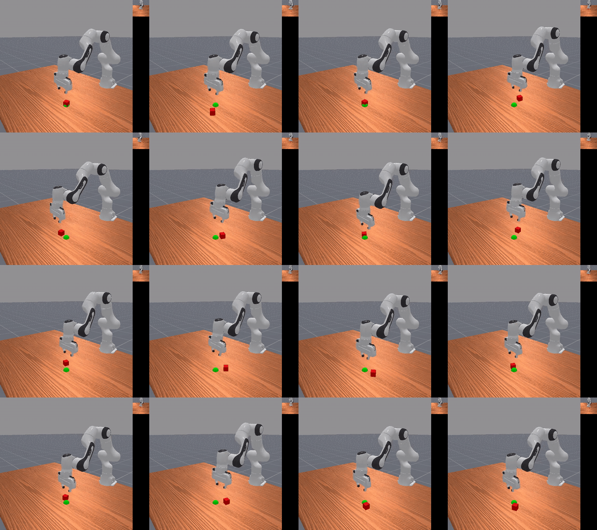

# pick_place_snn

Visual RL for cube lifting with a Franka Panda in ManiSkill. Compares SAC, DDPG
and DDPG with a spiking (SNN) actor, on state and on 64x64 RGB + proprioception.



## Task

`PandaLiftCube-v0` is `PickCubeEnv` without the place goal. Success means the
cube is grasped, lifted 5 cm, and held still (< 0.1 m/s) for 30 consecutive
steps (episodes are 100 steps). The hold requirement rules out policies that
flick the cube up or grab it for a single frame.

Dense reward (max 13, normalized by 13):

| Term | Formula | Weight |
| --- | --- | --- |
| reach | `1 - tanh(5 * tcp_to_obj_dist)` | 1.0 |
| grasp | `is_grasped` | 1.0 |
| lift | `(1 - tanh(10 * z_error)) * is_grasped` | 4.0 |
| static | `(1 - tanh(5 * arm_qvel_norm)) * is_lifted` | 0.5 |
| hold | `clamp(0.05 * hold_counter, max=1.5)` | 1.0 |
| success | `success` | 5.0 |
| drop | `ever_grasped & ~is_grasped` | -0.7 |
| drop after lift | `ever_lifted & ever_grasped & ~is_grasped` | -1.0 |

**Observations**

- state: joint positions/velocities, TCP pose, cube pose, TCP-to-cube offset,
  grasp flag
- rgb: 64x64 image from the base camera + proprio (joint state, TCP pose, grasp
  flag)

**Actions**: `pd_ee_delta_pos`, i.e. end-effector delta xyz + gripper (4-d).

## Methods

- **SAC**: ManiSkill's baseline implementation, used as a reference.
- **DDPG**: MLP for state; CNN encoder (64x64 -> 256-d) + proprio for RGB.
- **SNN-DDPG**: DDPG with a population-coded LIF actor (snnTorch, surrogate
  gradients, 16 timesteps, 10 neurons per action dim), based on
  [PopSAN](https://arxiv.org/abs/2010.09635). The critic and CNN encoder stay
  non-spiking.

### Architecture

DDPG (state): actor and critic are 3x256 MLPs.

DDPG (rgb): 5-layer conv encoder (16-32-64-64-64 channels, max-pooling to 4x4)
-> 256-d features, concatenated with proprio. Actor and critic heads are
512-256 MLPs.

SNN-DDPG actor:

```text
obs (or CNN features + proprio)
  -> FC -> LIF -> FC -> LIF -> FC(act_dim * pop_size) -> LIF readout
  -> linear decode of membrane voltage (per action dim) -> tanh -> action
```

The network is unrolled for `snn_timesteps` steps per action. The readout
layer doesn't spike; actions are decoded from its membrane voltage, which gives
smoother continuous outputs than spike counts. Gradients go through the spikes
via a fast-sigmoid surrogate.

### Hyperparameters

Shared DDPG defaults:

| Param | Value |
| --- | --- |
| gamma | 0.8 |
| tau | 0.01 |
| actor / critic lr | 3e-4 |
| exploration noise | 0.15 |
| learning starts | 4000 |
| training freq | 64 |
| batch size | 1024 (state), 256 (rgb) |
| replay buffer | 500k (state), 150k (rgb) |
| total steps | 500k (state), 1M (rgb) |

SNN-specific:

| Param | Value |
| --- | --- |
| `snn_timesteps` | 16 |
| `snn_beta` (membrane decay) | 0.9 |
| `snn_slope` (surrogate slope) | 25.0 |
| `snn_hidden` | 256 |
| `pop_size` | 10 |

## Setup

Linux, NVIDIA GPU (CUDA 12.1), conda.

```bash
bash scripts/bootstrap_env.sh
conda activate visrl
python scripts/validate_headless.py
```

This installs torch 2.3.1 and `mani-skill==3.0.0b22`, and clones ManiSkill
`v3.0.0b22` into `third_party/ManiSkill` for the SAC baseline scripts. Torch is
pinned because newer versions had PhysX GPU init issues on headless servers.

To see the env with random actions:

```bash
python scripts/demo_random_policy.py --steps 50   # saves to artifacts/demos/
```

## Training

```bash
# state
python scripts/train_state_sac.py      --config configs/phase1_lift_state.yaml
python scripts/train_state_ddpg.py     --config configs/phase1_lift_state_ddpg.yaml
python scripts/train_state_snn_ddpg.py --config configs/phase1_lift_state_snn_ddpg.yaml

# rgb + proprio
python scripts/train_rgb_sac.py      --config configs/phase2_lift_rgb.yaml
python scripts/train_rgb_ddpg.py     --config configs/phase2_lift_rgb_ddpg.yaml
python scripts/train_rgb_snn_ddpg.py --config configs/phase2_lift_rgb_snn_ddpg.yaml
```

RGB configs include an `oom_fallback_ladder` that retries with a smaller buffer
or fewer envs on OOM. Set `track: true` for W&B logging.

### Configs

| Config | Env | Obs | Algo |
| --- | --- | --- | --- |
| `phase0_stock_state` | PickCube-v1 | state | SAC (smoke test) |
| `phase1_lift_state` | PandaLiftCube-v0 | state | SAC |
| `phase1_lift_state_ddpg` | PandaLiftCube-v0 | state | DDPG |
| `phase1_lift_state_snn_ddpg` | PandaLiftCube-v0 | state | SNN-DDPG |
| `phase2_lift_rgb` | PandaLiftCube-v0 | rgb | SAC |
| `phase2_lift_rgb_ddpg` | PandaLiftCube-v0 | rgb | DDPG |
| `phase2_lift_rgb_snn_ddpg` | PandaLiftCube-v0 | rgb | SNN-DDPG |
| `pickcube_state_ddpg` | PickCube-v1 | state | DDPG |
| `pickcube_rgb_ddpg` | PickCube-v1 | rgb | DDPG |
| `eval_*` | | | evaluation |

## Evaluation

```bash
python scripts/evaluate_sac.py  --config configs/eval_lift_rgb.yaml
python scripts/evaluate_ddpg.py --config configs/eval_lift_rgb_ddpg.yaml

tensorboard --logdir runs/
python scripts/export_metrics.py --run-dir runs/<run_name>
```

Checkpoints, logs and videos are written to `runs/` (gitignored).

## Tests

```bash
pytest

# needs GPU rendering
VISRL_RUN_MANISKILL_TESTS=1 pytest tests/test_lift_cube.py -m integration
```

## Layout

```text
configs/            experiment and eval configs
scripts/            setup, training, eval, metrics export
src/rl_dev/
  algorithms/       DDPG and SNN-DDPG (state, rgb)
  envs/             PandaLiftCube-v0
  utils/            config loading, launchers, tensorboard export
tests/
third_party/        ManiSkill source (cloned by bootstrap)
```

## References

- Tang et al., [Deep Reinforcement Learning with Population-Coded Spiking
  Neural Network for Continuous Control](https://arxiv.org/abs/2010.09635),
  CoRL 2020
- [ManiSkill 3](https://github.com/haosulab/ManiSkill)
- [snnTorch](https://github.com/jeshraghian/snntorch)
